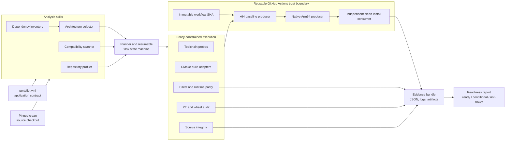

# PortPilot Architecture

## System view



## Application-specific versus reusable

| Application-specific input | Reusable PortPilot behavior |
|---|---|
| Source repository and immutable revision | Clean checkout, origin, revision, and mutation checks |
| Toolchain dependencies and probes | Allow-listed process execution and captured environment evidence |
| Baseline and target build commands | Manifest template expansion and phase isolation |
| Test suites and approved baseline failures | No-new-failures parity policy |
| Deterministic runtime scenarios | Normalized output assertions |
| Expected PE files and optional package | PE `Machine` verification and native wheel audit |
| Reviewed static-finding dispositions | Task completion and readiness gates |

PocketSphinx and whisper.cpp use different manifests and patches but the same
analysis engine, execution adapters, workflow, evidence layout, and reporting
rules.

## Trust boundaries

1. The manifest is schema-validated before use.
2. Source identity is pinned by origin and full commit SHA.
3. Commands are argument arrays; PortPilot does not invoke a shell.
4. Paths are containment-checked and PATH executables are allow-listed.
5. Resources, patches, tracked changes, and generated outputs are verified.
6. Cross-job state must match the trusted workflow manifest and project
   identity.
7. CI Python dependencies are version-pinned and SHA-256 verified.
8. A successful build does not clear static findings; terminal dispositions
   require rationale and evidence.

## Durable output

```text
runs/<run-id>/
  project.json
  inventory.json
  dependencies.json
  findings.json
  architecture-decision.json
  task-graph.json
  tasks/
  results/
  evidence/
  report.json
```

The artifact layout is stable across local runs, baseline jobs, native
producers, and clean-install consumers.
